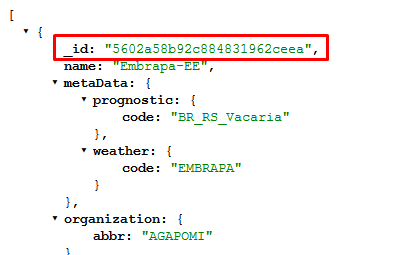

## Clima
Os dados meteorológicos são fornecidos pelo serviço sisalert. 


### Estações
```{r}
station <- "5602a58b92c884831962ceea"
```
Os códigos das estações estão disponíveis no link abaixo em formato JSON(JavaScript Object Notation), no campo _id, ilustrado na Imagem 1:

http://dev.sisalert.com.br/apirest/api/v1/stations


Imagem 1


### Dados metereológicos
```{r}
range <- "01-11-2014/01-01-2015"
```
Indica qual o intervalo usado para selecionar os dados metereológicos. A data inicial está localizada antes do / e a data final depois do /.

```{r}
datainicial <- "01-11-2014"
```
Data inicial

```{r}
datafinal <- "01-01-2015"
```
Data final


Com os dados de entrada fornecidos, é possivel montar a URL para solicitar os dados de clima

http://dev.sisalert.com.br/apirest/api/v1/data/station/model/5602a58b92c884831962ceea/range/01-11-2014/01-01-2015

```{r, echo=FALSE}
urlclima <- toString(paste("http://dev.sisalert.com.br/apirest/api/v1/data/station/model/" , station , "/range/", datainicial , "/" , datafinal, sep=""))
```

### Algoritmo em R
Segue o algoritmo que transforma de JSON para Data.frame: 
```{r message=FALSE, warning=FALSE}
library(RCurl)
library(rjson)
dataCurl <- getURLContent(urlclima, ssl.verifypeer = FALSE)
jsonWeather <- fromJSON(dataCurl)
weatherData <- do.call(rbind, lapply(jsonWeather, function(x) data.frame(x)))

head (weatherData)
```

